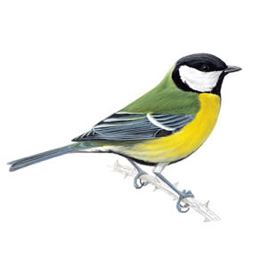

# doctit [](https://travis-ci.org/cofounders/doctit)

`document.title` helper utility for single page apps



## Dependencies

`doctit` requires [Underscore.js](http://underscorejs.org/).

## Installation

### Bower

`bower install doctit`

### NPM

`npm install doctit`

or

`package.json`

```json
...
dependencies: {
  "doctit": ""
}
...
```

### HTML

```html
<script src="doctit.js"></script>
```

## Usage

```javascript
// Using CommonJS
var doctitle = require('doctit');

// or AMD
define(['doctit'], function (doctit) {
  // ...
})

// Configuring the title separator
doctit.separator = ' - '; // Default
doctit.separator = ' — '; // Hipster
doctit.separator = ' | '; // Traditional
doctit.separator = ' · '; // Minimalist

// Setting the default title suffix
doctit.sitename = ''; // Don't show the separator and suffix (default)
doctit.sitename = 'My App'; // Always append this to the title

// Update the document title
doctit.message = 'Foo Bar'; // Now shows 'Foo Bar · My App'
doctit.message = ''; // Only the suffix remains 'My App'

// Flash a status message
doctit.flash('Stay awhile and listen');

// The bells and whistles
doctit.flash('Hold my beer!', {
  // Duration in milliseconds of each on/off cycle
  // Does not work in some browsers (Chrome) below 1000ms,
  // when the tab is inactive.
  speed: 2000,
  // Flash even if the page is visible
  visible: true,
  // Flash even if the page is hidden
  hidden: true,
  // Set to any negative number to flash forever
  times: 3,
  // Callback that checks if the message should keep flashing
  // The callback must return `true` to stop the flashing
  until: function () {},
  // Callback for when the flashing ends
  done: function () {}
});

// Example: Flash once, but only if the web app is in a hidden tab
doctit.flash('You\'ve got mail!', { visible: false, times: 1 });
```

## License

[MIT License](http://en.wikipedia.org/wiki/MIT_License)
